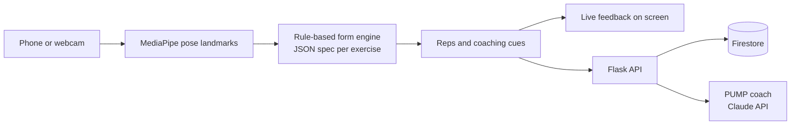

# Stream AI

**An AI workout coach that watches your form through any camera.**

Live at **[streamaiworkout.com](https://streamaiworkout.com)**

Stream AI counts your reps, catches form mistakes, and coaches you in real time. It runs in the browser on a phone or laptop. No wearables and no trainer.

> The source code is private while the product is in pre-launch. This repo is the public overview: what it does, how it's built, and what I decided along the way.

## What it does

**Live form coaching**
- Rep counting and form feedback for 11 lifts, using a side-view camera
- Pose detection with MediaPipe, then rule-based checks on the joint geometry
- Spoken and on-screen cues while you train

**Train**
- Workout builder with a 1,400+ exercise library, swaps, and per-set logging including partial reps
- Guided yoga classes with pose-hold tracking
- Powerlifting mode that measures bar velocity for squat, bench, and deadlift
- GPS run tracking with splits, best efforts, and training load
- Combat mode: coached boxing, kickboxing, and MMA rounds with a round timer and combos to learn

**Fuel**
- Calorie and macro tracking with a food database, barcode scan, photo meal logging, and nutrition-label scan
- Goal-weight planning with a suggested calorie target that adapts to your weight trend

**PUMP, the in-app coach**
- A Claude-powered chatbot that answers training and nutrition questions using a curated research library
- Safety rails for medical red flags, minors, and unsafe requests

## How it works

## Engineering notes

- **Rules over a trained classifier.** The first version used an LSTM trained on synthetic data. It scored well in testing and reached about 20% on real video. I dropped it for geometric rules on 2D landmarks, one spec file per exercise. Each rule can be tested and debugged on its own.
- **Tested against real footage.** A replay harness runs recorded videos through the trackers, so a change to detection shows up before it ships.
- **Monitored in production.** A CI job runs 100+ health checks against the live site, and 7,000+ automated tests run offline.
- **Security reviewed.** Features go through adversarial review passes covering auth, data privacy, and abuse limits before they ship.

## Stack

Python · Flask · Firebase Firestore · MediaPipe · Vanilla JavaScript · Bootstrap 5 · Google Cloud · Claude API

## Contact

**Seth Cohen** · [github.com/seth-cohen18](https://github.com/seth-cohen18) · [streamaiworkout.com](https://streamaiworkout.com)
